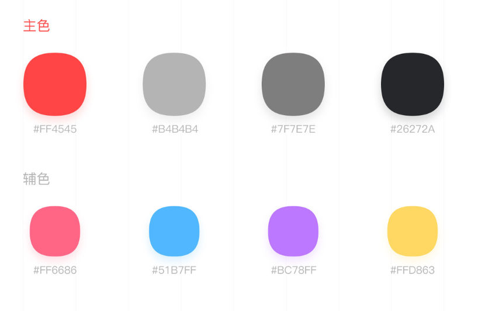

### 优优音乐
1. 接口文档
[NeteaseCloudMusicApi](https://binaryify.github.io/NeteaseCloudMusicApi/#/?id=neteasecloudmusicapi)

2. 颜色

3. 间距

```
左右10px,
顶部header请多留出30px。app为沉浸式，30px为状态栏
```

4. 字体
    
```
可选字体大小 (class)
font-sm :12px
font-md: 14px
font-lg" 16px
```
5. icon
```
请联系我在阿里巴巴icon上添加成员
```
6. 运行
```
yarn server
```
7. 打包
```
yarn build
```
8. demo展示
